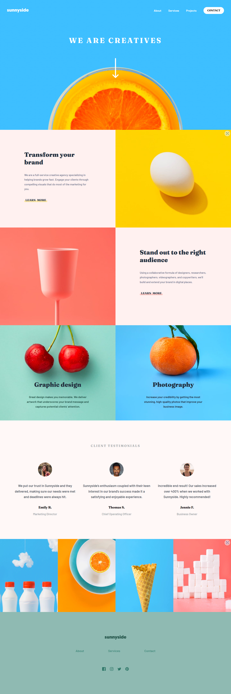

# Frontend Mentor - Sunnyside agency landing page solution

This is a solution to the [Sunnyside agency landing page challenge on Frontend Mentor](https://www.frontendmentor.io/challenges/sunnyside-agency-landing-page-7yVs3B6ef). Frontend Mentor challenges help you improve your coding skills by building realistic projects.

## Table of contents

-   [Overview](#overview)
    -   [The challenge](#the-challenge)
    -   [Screenshot](#screenshot)
    -   [Links](#links)
-   [My process](#my-process)
    -   [Built with](#built-with)
    -   [What I learned](#what-i-learned)
-   [Author](#author)

## Overview

### The challenge

Users should be able to:

-   View the optimal layout for the site depending on their device's screen size
-   See hover states for all interactive elements on the page

### Screenshot



### Links

-   Solution URL: [Solution URL](https://www.frontendmentor.io/solutions/sunnyside-agency-landing-page-ZlDhYlpCnD)
-   Live Site URL: [Live site URL](https://mk-milly02.github.io/sunnyside-agency-landing-page/)

## My process

### Built with

-   Semantic HTML5 markup
-   CSS custom properties
-   Flexbox
-   CSS Grid
-   Mobile-first workflow

### What I learned

```html
<link rel="preconnect" href="https://fonts.googleapis.com" />
<link rel="preconnect" href="https://fonts.gstatic.com" crossorigin />
<link
	href="https://fonts.googleapis.com/css2?family=Barlow:wght@600&family=Fraunces:opsz,wght@9..144,700;9..144,900&display=swap"
	rel="stylesheet"
/>
```

```css
@import url("https://fonts.googleapis.com/css2?family=Barlow:wght@600&family=Fraunces:opsz,wght@9..144,700;9..144,900&display=swap");
```

```js
let menu = document.querySelector(".menu");
let body = document.querySelector("body");
let link1 = document.querySelector("#learn-more-1");

function toggleMenu() {
	if (menu.classList.contains("show")) {
		menu.classList.remove("show");
		body.style.position = "static";
	} else {
		menu.classList.add("show");
		body.style.position = "fixed";
	}
}
```

## Author

-   Website - [Add your name here](https://www.your-site.com)
-   Frontend Mentor - [@yourusername](https://www.frontendmentor.io/profile/yourusername)
-   Twitter - [@yourusername](https://www.twitter.com/yourusername)
